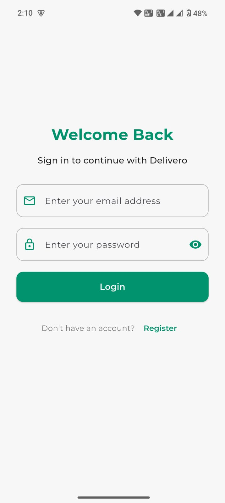
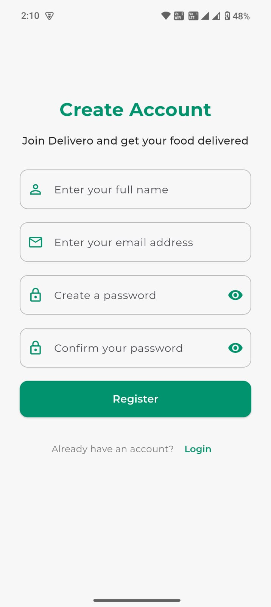
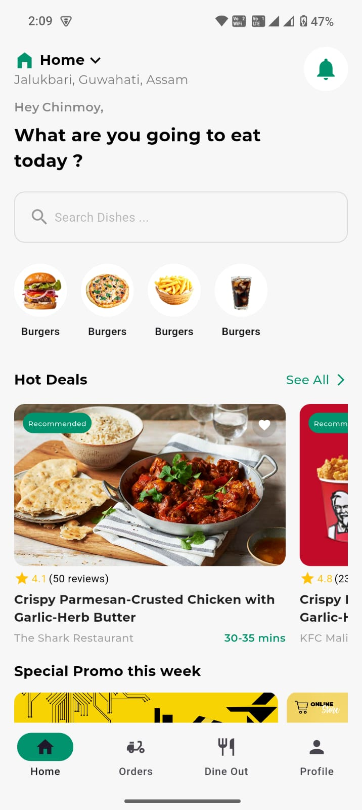
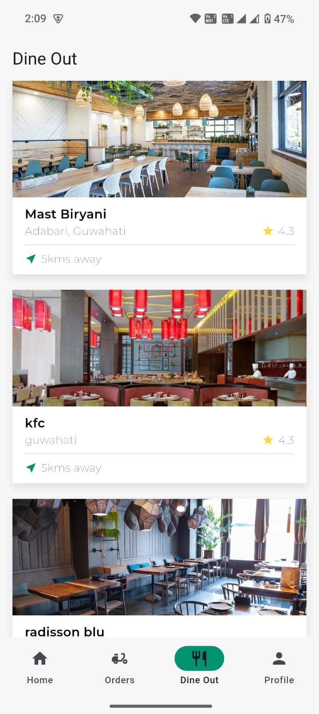

# 🍔 Delivero

A modern **food delivery app** built with **Flutter** and a **Node.js backend**, using **Supabase** as the database.  
Delivero is designed to provide a smooth and simple food-ordering experience with location-based services and JWT authentication.

---

## 🚀 Features

- 🔑 **Authentication with JWT** (secure login & signup)  
- 🏠 **Home Screen** with food categories and restaurants  
- 📍 **Geolocation & Geocoding** for delivery address management  
- 🛒 **Booking & Checkout Screens** for seamless order flow  
- 👤 **Profile Screen** to manage user information  
- ☁️ **Supabase backend** for real-time database and auth  

---

## 🛠️ Tech Stack

### Frontend (Flutter)
- [get](https://pub.dev/packages/get) – State management  
- [supabase_flutter](https://pub.dev/packages/supabase_flutter) – Supabase client  
- [geolocator](https://pub.dev/packages/geolocator) – Get user location  
- [geocoding](https://pub.dev/packages/geocoding) – Convert coordinates to addresses  
- [http](https://pub.dev/packages/http) – API requests  
- [google_fonts](https://pub.dev/packages/google_fonts) – Custom fonts  
- [font_awesome_flutter](https://pub.dev/packages/font_awesome_flutter) – Icons  

### Backend
- Node.js + Express  
- Supabase (PostgreSQL, Auth, Storage)  

---

## 📸 App Screens

<p align="center">
  
  
  
</p>

<p align="center">
  
  
  
  
</p>

---

## ⚙️ Getting Started

### Prerequisites
- [Flutter](https://docs.flutter.dev/get-started/install) installed  
- [Node.js](https://nodejs.org/en/download) installed  
- Supabase project set up (with API keys and database schema)

### Clone the repository
```bash
git clone https://github.com/Chinmoykoch/Delivero.git
cd Delivero
